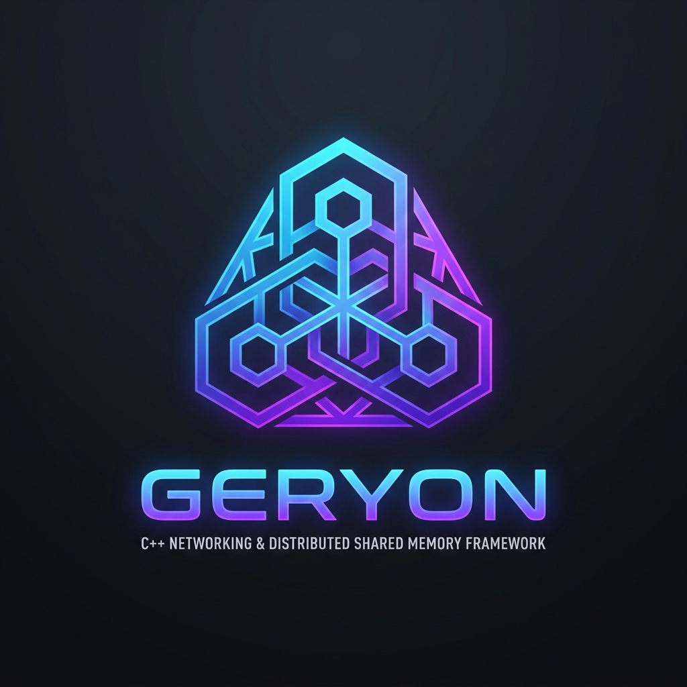
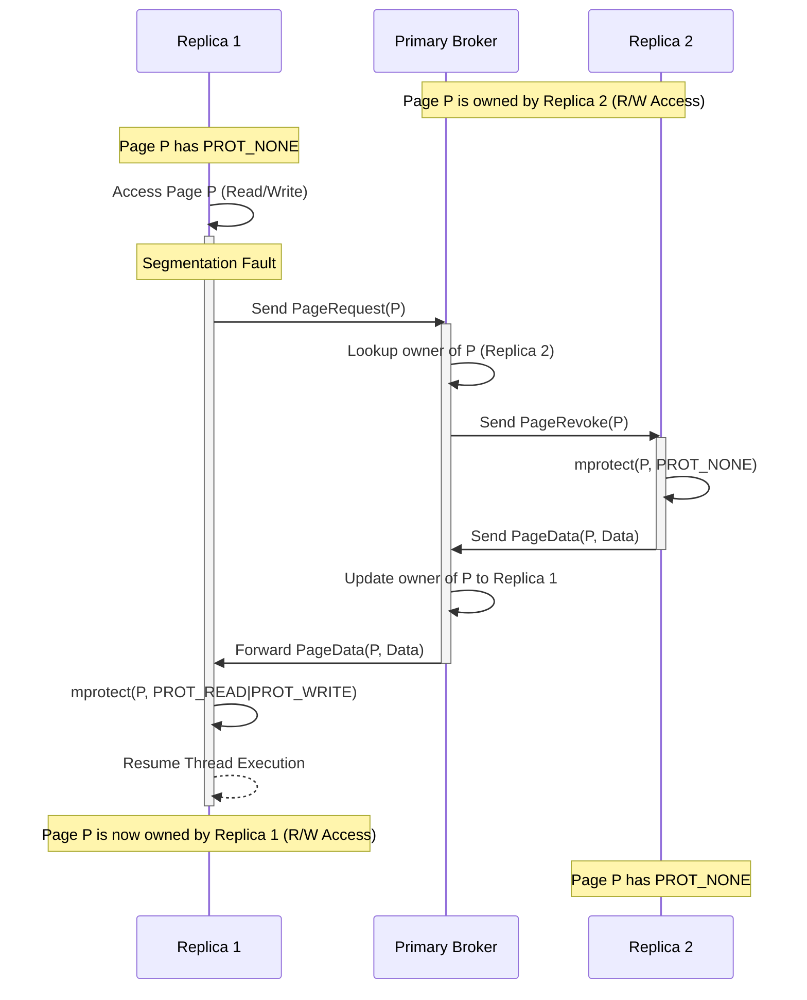
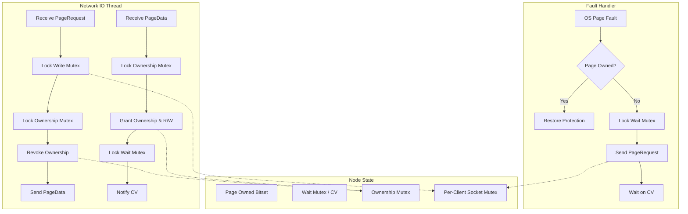

# Geryon

<p align="center">
  
</p>
Geryon is a C++26 cross-platform distributed shared memory framework. It transparently orchestrates shared memory regions across multiple systems via TCP/IP sockets. By utilizing low-level virtual memory manipulation, OS-level page fault handling, and seamless network synchronization, Geryon allows disparate nodes to access and modify a unified memory space as if they were sharing a local physical memory segment.

Geryon supports integration with existing memory mapping and interprocess communication libraries, including `boost::interprocess` and the [Memnon](https://github.com/qzeesh-max/Memnon) allocator, effectively transforming local interprocess communication into distributed cluster-wide communication.

## Key Features

*   **Cross-Platform Architecture:** Native implementations for macOS/iOS (Mach exception handling), Linux (sigaction + mprotect), and Windows (Vectored Exception Handling + VirtualAlloc).
*   **Transparent Page Fault Synchronization:** Geryon traps segmentation faults (soft faults) natively and orchestrates "Bouncing Ownership" page retrieval over TCP sockets, completely transparent to the accessing threads.
*   **Distributed Concurrency Control:** Includes custom spin locks natively designed for distributed settings:
    *   `geryon::recursive_spin_lock`: Mitigates lock starvation via network backoff when pages rapidly bounce between nodes.
    *   `geryon::robust_spin_lock`: Cluster-aware robust lock that tracks node liveness, automatically breaking locks held by dead or partitioned nodes without manual intervention.
*   **Manual State Synchronization:** Forces cache consistency by manually flushing pages from replicas back to the primary, paired with a graceful connection teardown handshake.
*   **Read-Only Replicas & Failover:** Supports operating replicas in a read-only mode, with automated wait-for-failover behavior and custom callbacks when primary connections drop.
*   **Third-Party Allocator Integration:** Easily drop-in advanced memory managers (e.g., `boost::interprocess` managed segments) and let Geryon handle the synchronization underneath. Includes built-in support for [Memnon's](https://github.com/qzeesh-max/Memnon) Segmented Managed Memory architectures to support dynamic transactional growth of shared memory pools across nodes seamlessly.

## Architecture

Geryon uses a **Star Topology Directory** protocol. Memory pages initially reside on the Primary node. When Replicas connect, they map an equivalent memory region with `PROT_NONE` (no access). The Primary acts as a Central Broker and Directory, tracking which Replica currently holds exclusive access to any given page.

When any node attempts to read or write a page it does not own, the OS throws an access violation/segmentation fault. Geryon's `GlobalFaultRegistry` catches this fault, pauses the faulting thread, and negotiates with the Primary to transfer the memory page over TCP.

### Why not `userfaultfd` on Linux?

While Linux provides `userfaultfd` for userspace page fault handling, Geryon relies on native POSIX signal handling (`sigaction(SIGSEGV)` + `siginfo_t`) instead. 

`userfaultfd` requires a dedicated polling thread to asynchronously read fault events from a file descriptor. This enforces an asynchronous architecture better suited for Virtual Machine Monitors (like QEMU) during live migration. Geryon is a thread-level concurrency framework where hundreds of application threads may fault concurrently. Using `SIGSEGV` ensures that the OS *synchronously* suspends only the specific faulting thread directly in the kernel, without bottlenecking through a single userspace polling queue. This preserves the multi-threaded concurrency model of the host application naturally.

Furthermore, `userfaultfd` has strict limitations on the types of memory and faults it can manage. While it handles missing pages for anonymous memory well, DSM requires intercepting *write* faults to transition pages from Read-Only to Read-Write. Support for write-protecting memory (`UFFDIO_WRITEPROTECT`) was only introduced for anonymous memory in Linux 5.7, and for shared memory (`tmpfs` / `shmem`) in Linux 5.19+. This makes it incompatible with most enterprise Linux distributions in use today. More importantly, `UFFDIO_WRITEPROTECT` still does not support general file-backed mappings (`MAP_SHARED` to disk). Because Geryon is explicitly designed to seamlessly wrap existing Interprocess Communication (IPC) memory managers (like `boost::interprocess` or `Memnon`) which heavily rely on named shared memory and file-backed mappings, `userfaultfd` is fundamentally incompatible with the core feature set of the library. Standard POSIX `mprotect` and `sigaction` work uniformly across all memory types, providing a stable and portable foundation.

### Bouncing Ownership Model (Multi-Client)

If Replica 1 requests a page that Replica 2 currently owns, the Primary brokers the transfer by requesting the page from Replica 2, and then forwarding the page to Replica 1. The framework uses a queue-based system to handle concurrent requests for the same page, allowing any number of replicas to continuously contest and modify the memory space.



### Protocol Synchronization



## Performance Benchmark

A demanding **Distributed Piecewise Sort Test** was used to validate network performance and memory stability. In this benchmark, a **256MB Shared Memory Region** containing **20 million random elements** is synchronously sorted across a star topology (1 Primary, 3 Replicas) using piecewise distributed workloads and cross-node lock contention.

Recent optimizations to the Bouncing Ownership protocol (resolving wait queue deadlocks and data races) have **drastically reduced redundant page transfers by ~75%**. Replicas no longer thrash the network with redundant `PageRequest` messages while waiting for heavily contested pages.

### Performance Matrix (Averaged across 25 runs)

| Platform | Avg Pages Sent (Primary) | Avg Pages Received (Primary) | Avg Transfer Time | Avg Time Between Transfers |
| --- | --- | --- | --- | --- |
| **macOS Native (Clang++)** | 3,671 | 3,670 | 2.78 µs | 213.19 µs |
| **Windows 10 CrossOver (MinGW-w64)** | 14,660 | 14,659 | 62.67 µs | 1,295.02 µs |
| **Linux Docker (Ubuntu 24.04)** | 14,660 | 14,659 | 4.56 µs | 225.38 µs |

*Note: The transfer latency remains extremely low on macOS and Linux, averaging **< 5 µs** per memory-mapped payload, highlighting the efficiency of the ASIO non-blocking I/O event loops even when heavily contested by multiple OS processes. Windows via CrossOver naturally shows higher latency (~62 µs) due to Vectored Exception Handling overhead.*

## Test Coverage

Geryon comes with a comprehensive, deterministic 15-test suite designed to validate consistency under heavy concurrency and varied OS architectures:

- **100% Passing Rate (25/25 consecutive runs)** across:
  - macOS Native (`clang++`)
  - Windows 10 via CrossOver (`mingw-w64`) using Vectored Exception Handling (VEH).
  - Linux Native via Docker (`ubuntu:24.04`) using `sigaction` and self-pipe thread synchronization.
- Tests simulate massive fault contention, validating correct queue processing for **Distributed Shared Memory Thrashing** and resolving edge cases where >60 threads aggressively request the same page memory address.
- Comprehensive coverage of cross-process shared memory objects (`InterprocessTest`), Memory segment mapping, Spin Locks (`SynchronizationTest`), Node disconnects, fault handler thread-safety, Memnon Segmented Memory mapping (`MemnonSegmentedTest`), and distributed piecewise processing over segmented memory (`DistributedSortTest`).

## Getting Started
### Prerequisites

*   C++26 compliant compiler (Clang, GCC, MSVC)
*   CMake 3.20+
*   Boost (Asio, Interprocess, System)
*   Google Test / Google Benchmark (fetched automatically by CMake)

### Building the Project

```bash
mkdir build && cd build
cmake ..
make -j$(nproc)
```

### Running Tests and Benchmarks

Geryon comes with a suite of integration, stress, and unit tests designed to simulate concurrent page fault loads across loopback interfaces.

```bash
# Run unit tests
./build/tests/geryon_tests

# Run page transfer benchmark
./build/benchmarks/benchmark_page_transfer
```

### Docker (Cross-Platform Testing on Linux)
To test Linux builds natively on macOS/Windows using Docker:
```bash
./scripts/run_linux_tests_docker.sh
```

### Windows (Cross-Compilation & CrossOver)
Geryon supports Windows cross-compilation from macOS using the `mingw-w64` toolchain. To build the `.exe` utilities, run:
```bash
./scripts/build_windows_on_mac.sh
```

To execute the Windows tests via CrossOver on macOS, initialize a "Windows 10" bottle and run:
```bash
./scripts/run_windows_tests_crossover.sh "Windows 10"
```

## Usage

### 1. Initializing Memory Regions

To share memory, first allocate identical Memory Regions on both the Primary and the Replica.

```cpp
#include <geryon/memory_region.hpp>

// Allocate a 1MB region
geryon::MemoryRegion region(1024 * 1024);
```

### 2. Setting Up Network Nodes

Wrap the Memory Region with a `NetworkNode`. The Primary starts the server and waits for the Replica to connect.

```cpp
#include <geryon/network_node.hpp>

// On Primary Node:
boost::asio::io_context io_ctx;
geryon::NetworkNode primary_node(io_ctx, region);
primary_node.start_primary(12345); // Binds to port 12345

// On Replica Node:
boost::asio::io_context io_ctx;
geryon::NetworkNode replica_node(io_ctx, region);
replica_node.start_replica("192.168.1.10", 12345); // Connects to Primary
```

### 3. Distributed Synchronization

To synchronize access across the distributed memory, Geryon provides several highly robust, cluster-aware synchronization primitives in `<geryon/synchronization.hpp>`. These primitives guarantee that if a node crashes or disconnects while holding the lock, the lock will automatically be broken or stolen to prevent cluster-wide deadlocks!

- **`robust_spin_lock`**: A simple Test-and-Set lock. Fast for low contention.
- **`robust_ticket_lock`**: A Bakery-algorithm ticket lock providing strict FIFO fairness. Dead nodes in the queue are automatically skipped.
- **`robust_epoch_lock`**: A heartbeat-based lock suitable for long-running critical sections. The lock is forcibly stolen if the owner fails to heartbeat.
- **`robust_mcs_lock`**: A highly scalable Queue-Based Spin Lock (MCS). Each node spins on its own local memory segment, virtually eliminating cache-coherence storms over the network.

```cpp
#include <geryon/synchronization.hpp>

struct SharedState {
    geryon::sync::mcs_lock lock;
    int data;
};

// Primary initializes the state
SharedState* state = new (region.base_address()) SharedState();

// Replica accesses it normally!
SharedState* state = reinterpret_cast<SharedState*>(region.base_address());
auto status = state->lock.lock();
if (status == geryon::robust_lock_status::owner_died) {
    // The previous lock owner died before releasing it!
    // Time to recover or fix any corrupted data structure state...
}

state->data++;
state->lock.unlock();
```

### 4. Manual Synchronization & Teardown

To ensure consistency of shared state without relying on page faults, you can trigger a manual synchronization. When a node is shutting down, it automatically initiates a handshake to ensure no data is lost.

```cpp
// Primary pulls all currently modified pages from Replicas
primary_node.trigger_synchronization();

// Graceful stop ensuring all data is flushed and synchronized
replica_node.stop();
primary_node.stop();
```

### 5. Read-Only Replicas & Failover

Replicas can be instantiated in read-only mode. In this mode, replica nodes have read access to the distributed memory, but any write attempts will safely block the faulting thread until the primary node disconnects.

```cpp
// Start the replica in read-only mode (read_only = true)
replica_node.start_replica("192.168.1.10", 12345, true);

// Set up a callback for when the primary dies
replica_node.set_on_primary_disconnect([]() {
    std::cout << "Primary disconnected! Replica promoted to R/W." << std::endl;
});
```

## License

Geryon is licensed under the [GNU Affero General Public License v3.0](LICENSE). For external dependencies, please see [CREDITS.md](CREDITS.md).
