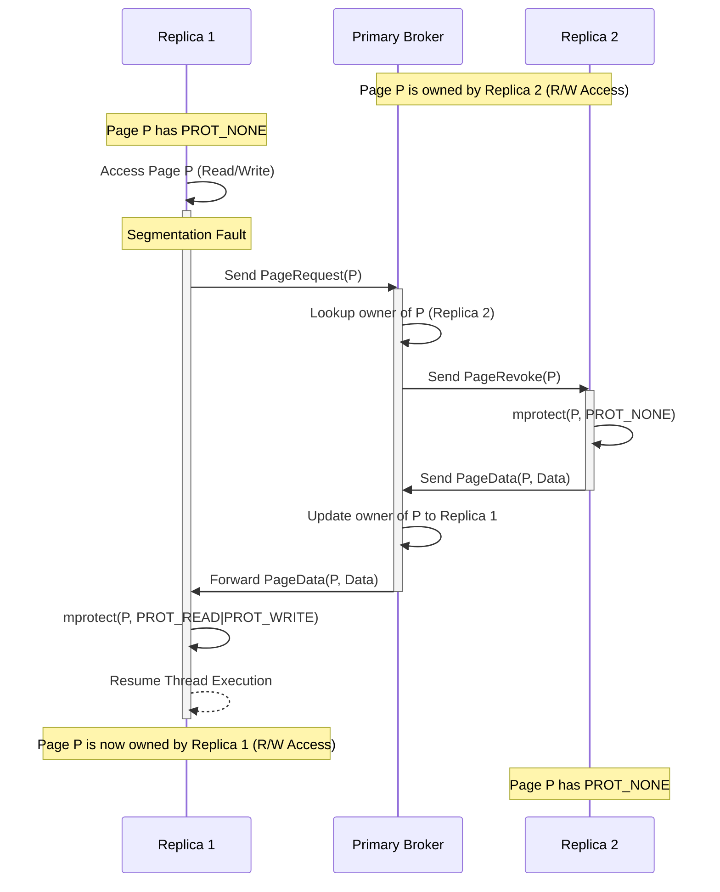
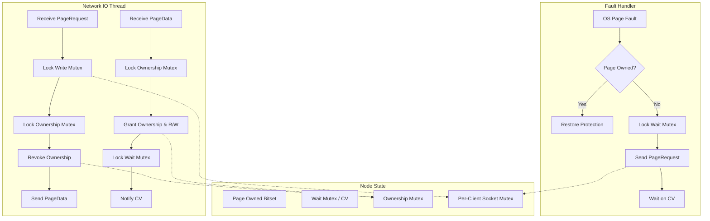

# Geryon

<p align="center">
  
</p>
Geryon is a C++26 cross-platform distributed shared memory framework. It transparently orchestrates shared memory regions across multiple systems via TCP/IP sockets. By utilizing low-level virtual memory manipulation, OS-level page fault handling, and seamless network synchronization, Geryon allows disparate nodes to access and modify a unified memory space as if they were sharing a local physical memory segment.

Geryon supports integration with existing memory mapping and interprocess communication libraries, including `boost::interprocess` and the [Memnon](https://github.com/qzeesh-max/Memnon) allocator, effectively transforming local interprocess communication into distributed cluster-wide communication.

## Key Features

*   **Cross-Platform Architecture:** Native implementations for macOS/iOS (Mach exception handling), Linux (sigaction + mprotect), and Windows (Vectored Exception Handling + VirtualAlloc).
*   **Transparent Page Fault Synchronization:** Geryon traps segmentation faults (soft faults) natively and orchestrates "Bouncing Ownership" page retrieval over TCP sockets, completely transparent to the accessing threads.
*   **Distributed Concurrency Control:** Includes a custom `geryon::recursive_spin_lock` which natively supports network backoff, mitigating lock starvation when pages rapidly bounce between nodes.
*   **Third-Party Allocator Integration:** Easily drop-in advanced memory managers (e.g., `boost::interprocess` managed segments) and let Geryon handle the synchronization underneath.

## Architecture

Geryon uses a **Star Topology Directory** protocol. Memory pages initially reside on the Primary node. When Replicas connect, they map an equivalent memory region with `PROT_NONE` (no access). The Primary acts as a Central Broker and Directory, tracking which Replica currently holds exclusive access to any given page.

When any node attempts to read or write a page it does not own, the OS throws an access violation/segmentation fault. Geryon's `GlobalFaultRegistry` catches this fault, pauses the faulting thread, and negotiates with the Primary to transfer the memory page over TCP.

### Bouncing Ownership Model (Multi-Client)

If Replica 1 requests a page that Replica 2 currently owns, the Primary brokers the transfer by requesting the page from Replica 2, and then forwarding the page to Replica 1. The framework uses a queue-based system to handle concurrent requests for the same page, allowing any number of replicas to continuously contest and modify the memory space.



### Protocol Synchronization



## Getting Started

### Prerequisites

*   C++26 compliant compiler (Clang, GCC, MSVC)
*   CMake 3.20+
*   Boost (Asio, Interprocess, System)
*   Google Test / Google Benchmark (fetched automatically by CMake)

### Building the Project

```bash
mkdir build && cd build
cmake ..
make -j$(nproc)
```

### Running Tests and Benchmarks

Geryon comes with a suite of integration, stress, and unit tests designed to simulate concurrent page fault loads across loopback interfaces.

```bash
# Run unit tests
./build/tests/geryon_tests

# Run page transfer benchmark
./build/benchmarks/benchmark_page_transfer
```

### Docker (Cross-Platform Testing)
To test Linux builds on macOS:
```bash
./docker/run_linux_tests_on_mac.sh
```

### Windows (Cross-Compilation & CrossOver)
Geryon supports Windows cross-compilation from macOS using the `mingw-w64` toolchain. To build the `.exe` utilities, run:
```bash
./scripts/build_windows_on_mac.sh
```

To execute the Windows tests via CrossOver on macOS, initialize a "Windows 10" bottle and run:
```bash
./scripts/run_windows_tests_crossover.sh "Windows 10"
```

## Usage

### 1. Initializing Memory Regions

To share memory, first allocate identical Memory Regions on both the Primary and the Replica.

```cpp
#include <geryon/memory_region.hpp>

// Allocate a 1MB region
geryon::MemoryRegion region(1024 * 1024);
```

### 2. Setting Up Network Nodes

Wrap the Memory Region with a `NetworkNode`. The Primary starts the server and waits for the Replica to connect.

```cpp
#include <geryon/network_node.hpp>

// On Primary Node:
boost::asio::io_context io_ctx;
geryon::NetworkNode primary_node(io_ctx, region);
primary_node.start_primary(12345); // Binds to port 12345

// On Replica Node:
boost::asio::io_context io_ctx;
geryon::NetworkNode replica_node(io_ctx, region);
replica_node.start_replica("192.168.1.10", 12345); // Connects to Primary
```

### 3. Distributed Synchronization

To synchronize access across the distributed memory, construct a `geryon::recursive_spin_lock` natively inside the memory region.

```cpp
#include <geryon/recursive_spin_lock.hpp>

struct SharedState {
    geryon::recursive_spin_lock lock;
    int data;
};

// Primary initializes the state
SharedState* state = new (region.base_address()) SharedState();

// Replica accesses it normally!
SharedState* state = reinterpret_cast<SharedState*>(region.base_address());
state->lock.lock();
state->data++;
state->lock.unlock();
```
